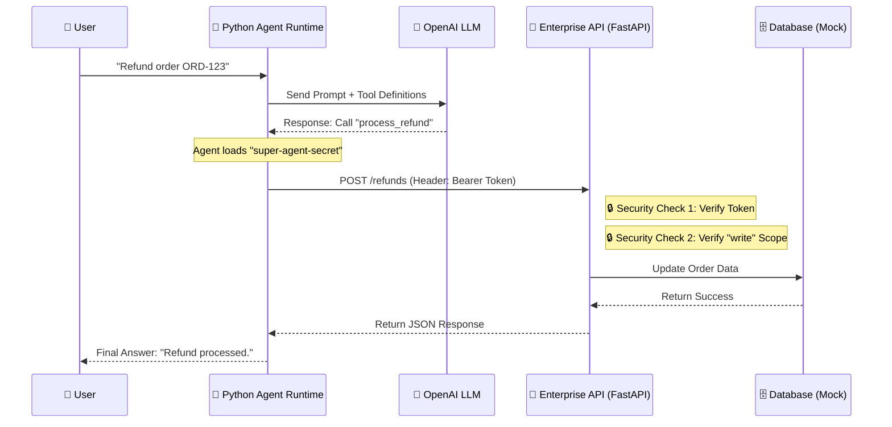

# Agentic FDE Demo: Secure AI-to-Enterprise Integration

## Overview
This project is a hands-on demonstration of a "Forward Deployed Engineer (FDE)" architecture. It showcases how to bridge the gap between a deterministic Enterprise System (using **FastAPI** and **Pydantic**) and a probabilistic AI Agent (using **OpenAI Function Calling**).

Crucially, this demo implements **Zero Trust Security**. The AI Agent is not given admin access; it must authenticate using a **Bearer Token** and is restricted by **Role-Based Access Control (RBAC)** scopes.

### Key Technologies
| Component | Technology | Purpose in Architecture |
| :--- | :--- | :--- |
| **Enterprise API** | FastAPI (Python) | The asynchronous backend hosting the business logic. |
| **Security** | OAuth2 / Scopes | Enforces Least Privilege. The Agent needs specific scopes (e.g., `write:refunds`) to execute actions. |
| **Data Validation** | Pydantic | Enforces strict data contracts (schema) for inputs and outputs. |
| **The Brain** | OpenAI (GPT-4o) | Acts as the reasoning engine to decide *which* tool to call. |
| **The Glue** | Python (`requests`) | The runtime that securely injects credentials and executes the AI's decision. |

---

## Architecture Diagram

This diagram illustrates the secure request flow. Note that the LLM *decides* the action, but the Python Runtime *injects* the credentials before hitting the API.

Prerequisites
Python 3.10+: Ensure Python is installed and accessible via terminal.

OpenAI API Key: You need a valid API key from platform.openai.com.

Setup & Installation
Clone or Create Project Folder

Bash

mkdir agent-fde-demo
cd agent-fde-demo
Create and Activate Virtual Environment

Bash

# Create venv
python3 -m venv venv

# Activate it (Mac/Linux)
source venv/bin/activate
# Activate it (Windows)
# .\venv\Scripts\activate
Install Dependencies

Bash

pip install fastapi uvicorn pydantic openai requests
Set OpenAI API Key

Mac/Linux: export OPENAI_API_KEY="sk-your-key-here"

Windows: $env:OPENAI_API_KEY = "sk-your-key-here"

Running the Demo
This demo requires two separate terminal windows running simultaneously.

🖥️ Terminal 1: The Secure Server
This represents the Enterprise API with Role-Based Access Control.

Navigate to the folder and activate venv.

Run the server:

Bash

python main.py
You should see: Uvicorn running on http://0.0.0.0:8000

🤖 Terminal 2: The Authenticated Agent
This represents the Client Application.

Open a new terminal, navigate to folder, activate venv.

Run the agent:

Bash

python agent.py
Testing Security Scenarios
This architecture demonstrates RBAC (Role-Based Access Control). You can modify agent.py to simulate different security levels.

Scenario A: The "Super Agent" (Default)
Token: super-agent-secret

Scopes: read:orders, write:refunds

Result: The Agent successfully processes the refund.

Scenario B: The "Junior Agent" (Permission Denied)
Open agent.py.

Change line 10 to: API_TOKEN = "junior-agent-secret"

Run python agent.py.

Result:

Plaintext

🤖 LLM Thought: Call process_refund
🔌 Executing: process_refund...
✅ API Result: Error: Permission Denied. You do not have the scope to perform this action.
This proves the API is protecting the database even if the AI tries to access it.

Key Files
main.py: The FastAPI server. It defines the Security Dependencies (has_scope), the Pydantic models, and the mocked database.

agent.py: The OpenAI Client. It manages the tool definitions, handles the HTTP requests library, and injects the Authorization headers.