# Agentic FDE Demo: Secure AI-to-Enterprise Integration

## Overview
This project is a hands-on demonstration of a "Forward Deployed Engineer (FDE)" architecture. It showcases how to bridge the gap between a deterministic Enterprise System (using **FastAPI** and **Pydantic**) and a probabilistic AI Agent (using **OpenAI Function Calling**).

Crucially, this demo implements **Zero Trust Security**. The AI Agent is not given admin access; it must authenticate using a **Bearer Token** and is restricted by **Role-Based Access Control (RBAC)** scopes.

### Key Technologies
| Component | Technology | Purpose in Architecture |
| :--- | :--- | :--- |
| **Enterprise API** | FastAPI (Python) | The asynchronous backend hosting the business logic. |
| **Security** | OAuth2 / Scopes | Enforces Least Privilege. The Agent needs specific scopes (e.g., `write:refunds`) to execute actions. |
| **Data Validation** | Pydantic | Enforces strict data contracts (schema) for inputs and outputs. |
| **The Brain** | OpenAI (GPT-4o-mini) | Acts as the reasoning engine to decide *which* tool to call. |
| **The Glue** | Python (`requests`) | The runtime that securely injects credentials and executes the AI's decision. |

---

## Architecture Diagram

This diagram illustrates the secure request flow. Note that the LLM *decides* the action, but the Python Runtime *injects* the credentials before hitting the API.

```mermaid
sequenceDiagram
    participant U as 👤 User
    participant A as 🤖 Python Agent Runtime
    participant L as 🧠 OpenAI LLM
    participant S as 🏢 Enterprise API (FastAPI)
    participant D as 🗄️ Database (Mock)

    U->>A: "Refund order ORD-123"
    
    A->>L: Send Prompt + Tool Definitions
    L-->>A: Response: Call "process_refund"
    Note over A: Agent loads "super-agent-secret"

    A->>S: POST /refunds (Header: Bearer Token)
    
    Note right of S: 🔒 Security Check 1: Verify Token
    Note right of S: 🔒 Security Check 2: Verify "write" Scope
    
    S->>D: Update Order Data
    D-->>S: Return Success
    
    S-->>A: Return JSON Response
    A-->>U: Final Answer: "Refund processed."
```

Prerequisites
Python 3.10+: Ensure Python is installed and accessible via terminal.

OpenAI API Key: You need a valid API key from platform.openai.com.

Setup & Installation
Clone or Create Project Folder

Bash

mkdir agent-fde-demo
cd agent-fde-demo
Create and Activate Virtual Environment

Bash

# Create venv
python3 -m venv venv

# Activate it (Mac/Linux)
source venv/bin/activate
# Activate it (Windows)
# .\venv\Scripts\activate
Install Dependencies

Bash

pip install fastapi uvicorn pydantic openai requests
Set OpenAI API Key

Mac/Linux: export OPENAI_API_KEY="sk-your-key-here"

Windows: $env:OPENAI_API_KEY = "sk-your-key-here"

Running the Demo
This demo requires two separate terminal windows running simultaneously.

🖥️ Terminal 1: The Secure Server
This represents the Enterprise API with Role-Based Access Control.

Navigate to the folder and activate venv.

Run the server:

Bash

python main.py
You should see: Uvicorn running on http://0.0.0.0:8000

🤖 Terminal 2: The Authenticated Agent
This represents the Client Application.

Open a new terminal, navigate to folder, activate venv.

Run the agent:

Bash

python agent.py
Testing Security Scenarios
This architecture demonstrates RBAC (Role-Based Access Control). You can modify agent.py to simulate different security levels.

Scenario A: The "Super Agent" (Default)
Token: super-agent-secret

Scopes: read:orders, write:refunds

Result: The Agent successfully processes the refund.

Scenario B: The "Junior Agent" (Permission Denied)
Open agent.py.

Change line 10 to: API_TOKEN = "junior-agent-secret"

Run python agent.py.

Result:

Plaintext

🤖 LLM Thought: Call process_refund
🔌 Executing: process_refund...
✅ API Result: Error: Permission Denied. You do not have the scope to perform this action.
This proves the API is protecting the database even if the AI tries to access it.

Key Filesmain.py: The FastAPI server. It defines the Security Dependencies (has_scope), the Pydantic models, and the mocked database.agent.py: The OpenAI Client. It manages the tool definitions, handles the HTTP requests library, and injects the Authorization headers.🧩 Part 2: Model Context Protocol (MCP) LabThis section covers the Model Context Protocol (MCP) implementation. Unlike the HTTP/Rest implementation above, this demonstrates the standardized Host <-> Client <-> Server architecture used by tools like Claude Desktop and Cursor.Architecture OverviewIn this lab, we simulate the full MCP lifecycle locally using Standard IO (stdio).FileMCP RoleDescriptionmain_mcp.pyMCP Host & ClientActs as the AI Application (like Cursor/Claude). It initiates the connection, manages the session, and orchestrates the AI loop.agent_mcp.pyMCP ServerActs as the Tool Provider. It holds the CRM data and exposes specific capabilities (add_customer, get_customer) to the Host.MCP Flow DiagramCode snippetsequenceDiagram
    participant H as 🖥️ MCP Host (main_mcp.py)
    participant C as 🔌 MCP Client (Internal)
    participant S as 🛠️ MCP Server (agent_mcp.py)
    participant DB as 🗄️ CRM Data (Memory)

    Note over H, S: Transport: Standard IO (stdin/stdout)

    H->>S: Initialize Connection
    S-->>H: Handshake (Protocol Version)
    
    H->>S: List Tools?
    S-->>H: Returns: [add_customer, get_customer]
    
    Note over H: Host receives user prompt: "Add Alice"
    
    H->>C: Call Tool: add_customer(name="Alice")
    C->>S: JSON-RPC Request
    S->>DB: Write to CRM
    S-->>C: Return "Success"
    C-->>H: Display Result
🚀 Running the MCP LabThis implementation requires the mcp python SDK.1. Install Additional DependencyBashpip install mcp
2. Run the HostYou only need to run the Host script. The Host automatically launches the Server as a subprocess.Bashpython main_mcp.py
3. Expected OutputPlaintextConnecting to server script: agent_mcp.py...
Connected to server: CRM-MCP-Server
Server capabilities: {'tools': ...}
...
User: I need to add a customer named Alice...
Tool Output: Customer Alice added to CRM.
🛠️ File DetailsThe Server (agent_mcp.py)This file uses @mcp.tool() to expose Python functions to the AI. It is completely isolated from the AI model itself—it simply executes logic when asked.Python@mcp.tool()
def add_customer(name: str, email: str) -> str:
    # Logic to add customer to database
    return "Success"
The Host (main_mcp.py)This file contains the MCP Client. It uses StdioServerParameters to tell the system how to start the server.Pythonserver_params = StdioServerParameters(
    command="python",
    args=["agent_mcp.py"] # The Host launches the Server
)
🧠 Key Takeaways for FDEsPortability: The agent_mcp.py server you built here can be plugged into Claude Desktop, Cursor, or VS Code without changing a single line of code.Security: The Host (AI) is isolated from the Server (Data). The Server defines strict boundaries on what the AI can and cannot do.